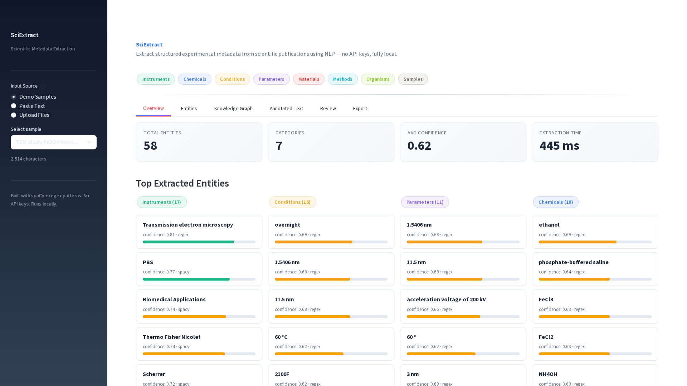
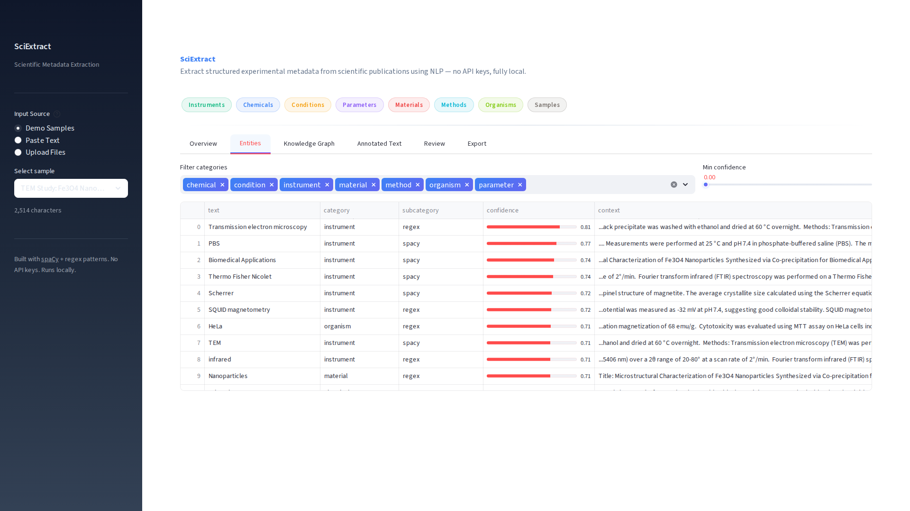
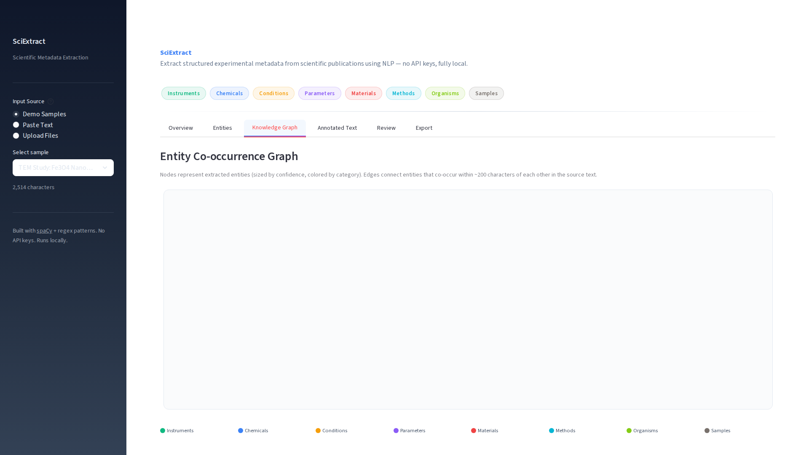
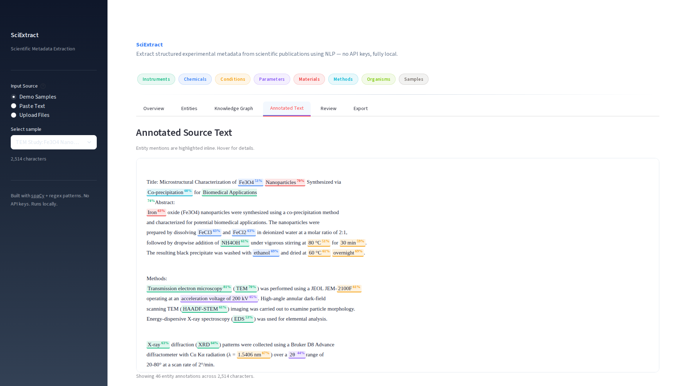
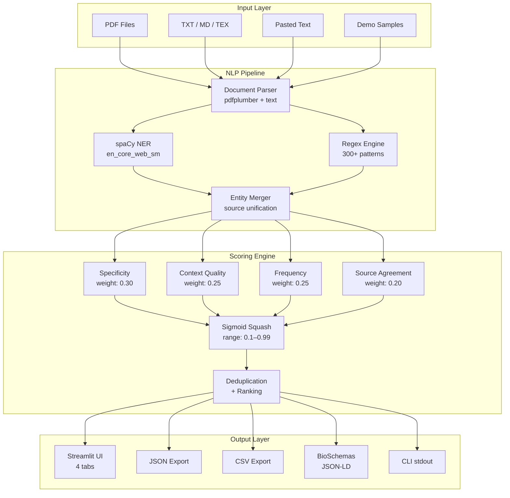
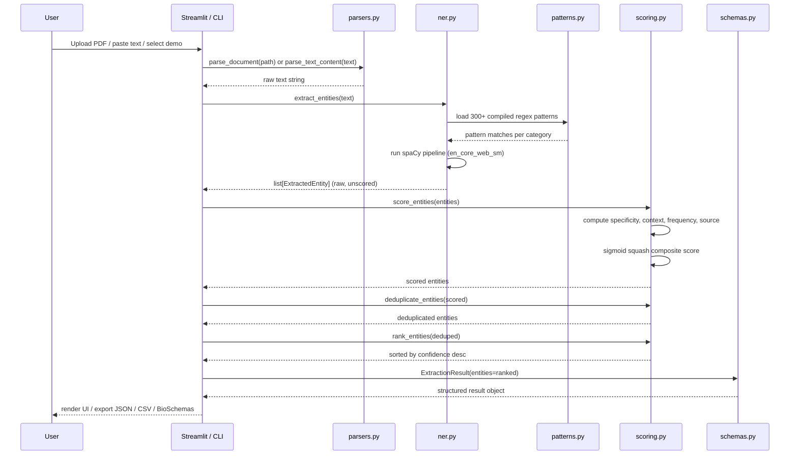
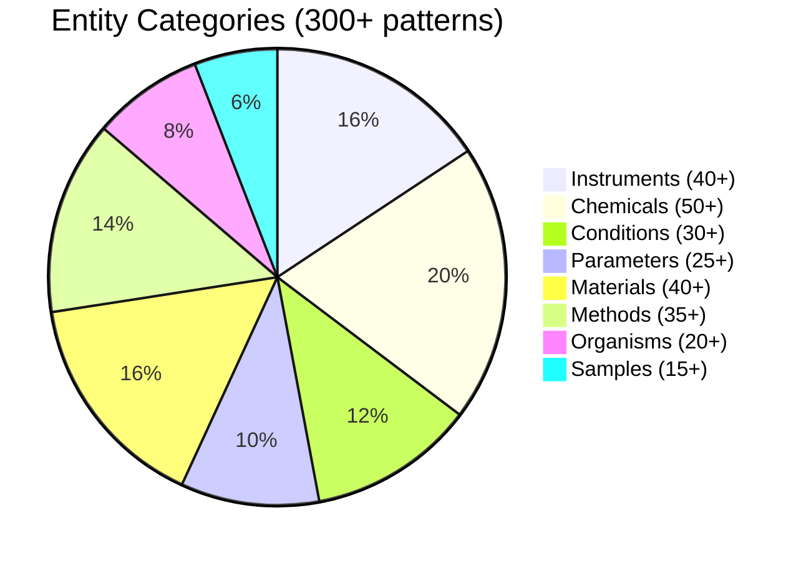

<div align="center">

# LabLens

**Turn any scientific paper into a structured, searchable experiment protocol in seconds.**

[](https://www.python.org/downloads/)
[](LICENSE)
[](https://spacy.io/)
[](https://streamlit.io/)
[]()
[](Dockerfile)

<p>
  <a href="#features">Features</a> &bull;
  <a href="#demo">Demo</a> &bull;
  <a href="#quick-start">Quick Start</a> &bull;
  <a href="#architecture">Architecture</a> &bull;
  <a href="#tech-stack">Tech Stack</a> &bull;
  <a href="#cli-usage">CLI</a> &bull;
  <a href="#export-formats">Exports</a>
</p>



</div>

---

## The Problem

Scientific papers bury critical experimental details — instruments, reagents, conditions, parameters — in dense prose. Reproducing an experiment means manually reading papers and copy-pasting metadata into spreadsheets. Systematic reviews across 50+ papers? Days of tedious extraction work.

## The Solution

LabLens combines **spaCy NER** with **300+ domain-specific regex patterns** to automatically identify and classify scientific entities across **8 categories**. Drop in a PDF, paste an abstract, or pipe text from the command line — get structured, exportable metadata in under a second. No API keys, no cloud dependencies, fully local.

---

## Features

| Feature | Description |
|---------|-------------|
| **Multi-Format Input** | Parse PDFs (pdfplumber), plain text, Markdown, and LaTeX files. Paste text directly or upload multiple files for batch processing. |
| **8 Entity Categories** | Extract instruments, chemicals, conditions, parameters, materials, methods, organisms, and sample types with category-specific pattern libraries. |
| **Confidence Scoring** | Four-signal composite scoring: pattern specificity (0.30), contextual cues (0.25), document frequency (0.25), and source agreement (0.20). Sigmoid-squashed to [0.1, 0.99]. |
| **Knowledge Graph** | Force-directed entity relationship graph showing co-occurrence links between instruments, materials, and conditions within the same text passages. |
| **Annotated Text** | Inline entity highlighting with color-coded spans matching each category, hover tooltips for confidence and subcategory. |
| **Protocol Card** | Reconstructed experiment summary organized as: Materials -> Methods -> Conditions -> Instruments -> Parameters. A printable, structured protocol from unstructured text. |
| **Interactive Review** | Accept or reject individual entities in the Streamlit UI. Reviewed state persists across tabs and propagates to exports. |
| **BioSchemas Export** | Schema.org-compatible JSON-LD output for FAIR data interoperability. Also exports to JSON and CSV. |
| **Batch Processing** | Process multiple documents in a single CLI invocation or upload session. Results merge into a unified extraction with per-document attribution. |
| **Zero Dependencies on Cloud** | Runs entirely locally using spaCy `en_core_web_sm`. No API keys, no external services, no data leaves your machine. |

---

## Demo

<div align="center">
<table>
<tr>
<td></td>
<td></td>
</tr>
<tr>
<td><strong>Dashboard Overview</strong> — Metric cards, entity breakdown by category, confidence-coded entity cards with visual bars</td>
<td><strong>Entity Explorer</strong> — Filterable table with multi-select category filters and adjustable confidence threshold</td>
</tr>
<tr>
<td></td>
<td></td>
</tr>
<tr>
<td><strong>Interactive Review</strong> — Accept or reject entities one by one with paginated navigation and verification state tracking</td>
<td><strong>Export Panel</strong> — Download in JSON, CSV, or BioSchemas JSON-LD with inline previews before download</td>
</tr>
</table>
</div>

---

## Architecture



### Data Flow



### Entity Category Breakdown



---

## Entity Categories

| Category | Description | Example Entities | Pattern Count |
|----------|-------------|------------------|:---:|
| **Instrument** | Microscopes, spectrometers, analytical equipment | SEM, TEM, XRD, FTIR, NMR, AFM, SQUID, HAADF-STEM | 40+ |
| **Chemical** | Reagents, solvents, compounds, buffers | H2O, NaCl, ethanol, PBS, DMSO, TiO2, Fe3O4 | 50+ |
| **Condition** | Experimental conditions and environmental parameters | 25 °C, pH 7.4, 1 atm, 8000 rpm, 30 min, anaerobic | 30+ |
| **Parameter** | Measurement values, instrument settings, quantified results | 532 nm, 200 kV, 10 kHz, 1.5406 nm, 15 nm diameter | 25+ |
| **Material** | Substrates, scaffolds, composites, raw materials | graphene, PLGA, collagen, silicon wafer, carbon nanotube | 40+ |
| **Method** | Synthesis techniques, analytical methods, procedures | CVD, spin coating, hydrothermal, electrospinning, sol-gel | 35+ |
| **Organism** | Biological species, cell lines, microbial strains | E. coli, HeLa, mesenchymal stem cells, S. aureus | 20+ |
| **Sample** | Physical forms, preparations, specimen types | thin film, nanoparticles, scaffold, powder, dispersion | 15+ |

---

## Quick Start

### Prerequisites

- **Python 3.12+**
- **[uv](https://docs.astral.sh/uv/)** (recommended) or pip

### Install and Run

```bash
# Clone the repository
git clone https://github.com/Akasxh/lablens.git
cd lablens

# Install dependencies + download spaCy model
uv sync
uv run python -m spacy download en_core_web_sm

# Launch the web UI (opens at http://localhost:8501)
uv run streamlit run src/app.py
```

The app loads with **Demo Samples** selected by default — click through to see extraction results immediately. No files needed.

### One-Liner

```bash
uv sync && uv run python -m spacy download en_core_web_sm && uv run streamlit run src/app.py
```

### Using Make

```bash
make install   # Install dependencies + spaCy model
make run       # Launch Streamlit on port 8501
make dev       # Launch with auto-reload on file save
make test      # Run test suite
make lint      # Run ruff linter + formatter check
```

---

## Docker Setup

### Build and Run

```bash
# Build the image
docker build -t lablens:latest .

# Run the container
docker run --rm -p 8501:8501 lablens:latest
```

Open [http://localhost:8501](http://localhost:8501) in your browser.

### Docker Compose

```bash
# Copy environment file
cp .env.example .env

# Start the service
docker compose up -d

# View logs
docker compose logs -f app

# Stop
docker compose down
```

The Docker image uses a **multi-stage build** (builder + runtime) to minimize image size. The runtime stage runs as a non-root `appuser` with a built-in healthcheck on `/_stcore/health`.

---

## CLI Usage

LabLens ships with a full CLI for automation and batch processing.

```bash
# Process a single PDF
cd src && uv run python cli.py --input paper.pdf

# Process multiple files with CSV export
cd src && uv run python cli.py -i paper1.pdf paper2.txt -o results -f csv

# Extract from direct text
cd src && uv run python cli.py --text "TEM analysis at 200 kV revealed TiO2 nanoparticles"

# Run on built-in demo samples
cd src && uv run python cli.py --demo

# Quiet mode — JSON to stdout, no summary
cd src && uv run python cli.py --demo --quiet

# Pipe from stdin
echo "SEM imaging of graphene nanosheets at 15 kV" | cd src && uv run python cli.py

# Export as BioSchemas JSON-LD
cd src && uv run python cli.py --demo -o output -f bioschemas
```

### CLI Flags

| Flag | Short | Description |
|------|-------|-------------|
| `--input` | `-i` | Input file path(s) — PDF, TXT, MD, TEX |
| `--text` | `-t` | Direct text string for extraction |
| `--output` | `-o` | Output file path (default: stdout) |
| `--format` | `-f` | Output format: `json`, `csv`, `bioschemas` |
| `--quiet` | `-q` | Suppress summary, emit structured data only |
| `--demo` | | Run extraction on built-in sample papers |

### Sample CLI Output

```
======================================================================
Document: TEM Study: Fe₃O₄ Nanoparticles
Text length: 3,247 chars
Extraction time: 142 ms
Total entities: 64
======================================================================

  Instruments (9):
    [████████░░] 0.93  transmission electron microscopy
    [████████░░] 0.88  HAADF-STEM
    [████████░░] 0.85  energy-dispersive X-ray spectroscopy

  Chemicals (8):
    [████████░░] 0.85  Fe3O4
    [████████░░] 0.82  oleic acid
    [███████░░░] 0.79  FeCl3

  Conditions (12):
    [████████░░] 0.87  80 °C
    [████████░░] 0.84  pH 10
    [███████░░░] 0.78  30 min
```

---

## Python Library Usage

Use LabLens programmatically in your own scripts or notebooks.

```python
import sys
sys.path.insert(0, "src")
from extractor import extract_from_text, extract_from_file, extract_batch

# Extract from text
result = extract_from_text("""
    TEM analysis at 200 kV revealed spherical TiO2 nanoparticles
    with an average diameter of 15 nm synthesized via hydrothermal method.
""")

print(f"Found {len(result.entities)} entities in {result.extraction_time_ms:.0f} ms")
for entity in result.entities[:5]:
    print(f"  {entity.text:30s}  {entity.category:12s}  {entity.confidence:.2f}")

# Export to different formats
json_str = result.to_json(indent=2)          # Full JSON
csv_rows = result.to_csv_rows()              # List of dicts for DataFrame
bioschemas = result.to_bioschemas()          # Schema.org JSON-LD

# Extract from a file
result = extract_from_file(Path("paper.pdf"))

# Batch process multiple files
results = extract_batch([Path("paper1.pdf"), Path("paper2.txt")])
```

### ExtractionResult API

```python
result.entities          # list[ExtractedEntity] — all entities, ranked by confidence
result.instruments       # Filtered: instrument entities only
result.chemicals         # Filtered: chemical entities only
result.conditions        # Filtered: condition entities only
result.parameters        # Filtered: parameter entities only
result.materials         # Filtered: material entities only
result.methods           # Filtered: method entities only
result.organisms         # Filtered: organism entities only
result.samples           # Filtered: sample entities only
result.extraction_time_ms  # Pipeline execution time
result.raw_text_length     # Input document character count
result.to_dict()         # Full dict representation
result.to_json()         # JSON string
result.to_csv_rows()     # List of flat dicts for CSV/DataFrame
result.to_bioschemas()   # BioSchemas JSON-LD dict
```

---

## Confidence Scoring

Every extracted entity receives a composite confidence score in the range **[0.1, 0.99]**, computed from four independent signals and passed through a sigmoid squashing function.

| Signal | Weight | What It Measures |
|--------|:------:|------------------|
| **Specificity** | 0.30 | Longer, more specific entity text scores higher. "transmission electron microscopy" > "TEM" > "pH". |
| **Context** | 0.25 | Presence of category-specific action verbs near the entity. E.g., "dissolved" boosts chemicals, "measured" boosts instruments. Section headers ("Methods", "Materials") also boost scores. |
| **Frequency** | 0.25 | Entities mentioned 3+ times in the document score higher — repeated mentions signal importance. |
| **Source Agreement** | 0.20 | Entities found by **both** spaCy NER and regex receive the highest score (0.95). Single-source extractions score lower. |

**Scoring formula:**

```
raw = 0.30 * specificity + 0.25 * context + 0.25 * frequency + 0.20 * source
confidence = 0.1 + 0.89 / (1 + exp(-6 * (raw - 0.5)))
```

Post-scoring, entities are **deduplicated** (same normalized text + category = merge, keep highest confidence) and **ranked** by confidence descending.

---

## Tech Stack

| Tool | Version | Purpose |
|------|---------|---------|
| **Python** | 3.12+ | Runtime |
| **spaCy** | 3.7+ | Named Entity Recognition (NER) pipeline with `en_core_web_sm` model |
| **Streamlit** | 1.30+ | Web UI framework with custom CSS, tabs, entity cards, and interactive review |
| **pdfplumber** | 0.11+ | PDF text extraction with layout-aware parsing |
| **pandas** | 2.1+ | DataFrame operations for CSV export and entity table rendering |
| **regex** | 2024.1+ | Advanced regex engine for Unicode-aware scientific pattern matching |
| **scikit-learn** | 1.4+ | ML utilities for text processing |
| **uv** | latest | Dependency management and virtual environment (replaces pip) |
| **ruff** | latest | Linting and formatting (replaces black + isort + flake8) |
| **pytest** | 9.0+ | Test framework |
| **Docker** | latest | Containerized deployment with multi-stage build |
| **hatchling** | latest | Python package build backend |

---

## Project Structure

```
lablens/
├── src/
│   ├── __init__.py          # Package exports
│   ├── app.py               # Streamlit web interface (635 lines)
│   ├── cli.py               # CLI with argparse (136 lines)
│   ├── extractor.py         # Pipeline orchestrator: parse → extract → score → export
│   ├── ner.py               # spaCy NER + regex extraction engine
│   ├── parsers.py           # PDF (pdfplumber) and text file parsing
│   ├── patterns.py          # 300+ regex patterns across 8 categories
│   ├── sample_papers.py     # 5 built-in synthetic demo papers
│   ├── schemas.py           # Typed dataclasses (ExtractedEntity, ExtractionResult)
│   └── scoring.py           # Multi-signal confidence scoring + deduplication
├── tests/
│   ├── __init__.py
│   ├── conftest.py          # Shared fixtures
│   ├── test_extractor.py    # Pipeline integration tests
│   ├── test_ner.py          # NER extraction tests
│   ├── test_parsers.py      # Document parsing tests
│   ├── test_patterns.py     # Regex pattern coverage tests
│   ├── test_schemas.py      # Schema serialization tests
│   └── test_scoring.py      # Scoring algorithm tests
├── screenshots/
│   ├── hero.png             # Main dashboard screenshot
│   └── dashboard.png        # Additional UI screenshot
├── Dockerfile               # Multi-stage build (builder + runtime)
├── docker-compose.yml       # Single-service compose with healthcheck
├── Makefile                 # install, run, dev, test, lint, clean, docker-*
├── pyproject.toml           # Project metadata, dependencies, ruff config
├── .env.example             # Environment variable template
├── .gitignore               # Python, IDE, OS ignores
├── LICENSE                  # MIT License
├── CLAUDE.md                # Development context and notes
└── README.md                # This file
```

---

## Export Formats

### JSON

Full extraction results with all metadata, entity details, and document-level statistics.

```json
{
  "document_name": "TEM Study: Fe3O4 Nanoparticles",
  "raw_text_length": 3247,
  "extraction_time_ms": 142.3,
  "entity_count": 64,
  "entities": [
    {
      "text": "transmission electron microscopy",
      "category": "instrument",
      "subcategory": "spacy+regex",
      "confidence": 0.93,
      "source_span": [45, 76],
      "context": "...characterized using transmission electron microscopy (TEM) operated at...",
      "verified": false
    }
  ],
  "summary": {
    "samples": 4, "instruments": 9, "conditions": 12,
    "parameters": 15, "materials": 6, "methods": 5,
    "chemicals": 8, "organisms": 5
  }
}
```

### CSV

Flat tabular format with one row per entity. Columns: `document`, `text`, `category`, `subcategory`, `confidence`, `context`, `verified`, `span_start`, `span_end`.

### BioSchemas JSON-LD

[Schema.org](https://schema.org)-compatible linked data for FAIR interoperability. Maps entities to `DefinedTerm` objects, parameters to `PropertyValue`, and methods to `measurementTechnique`.

```json
{
  "@context": "https://schema.org",
  "@type": "Dataset",
  "name": "TEM Study: Fe3O4 Nanoparticles",
  "keywords": [
    {"@type": "DefinedTerm", "name": "TEM", "inDefinedTermSet": "instrument"}
  ],
  "variableMeasured": [
    {"@type": "PropertyValue", "name": "200 kV", "description": "..."}
  ],
  "measurementTechnique": ["co-precipitation", "hydrothermal"]
}
```

---

## Testing

```bash
# Run the full test suite
uv run pytest tests/ -v

# Run a specific test module
uv run pytest tests/test_scoring.py -v

# Quick smoke test (no pytest needed)
uv run python -c "from src.sample_papers import *; print('Imports OK')"

# Lint check
uv run ruff check src/
uv run ruff format --check src/
```

---

## Environment Variables

| Variable | Default | Description |
|----------|---------|-------------|
| `STREAMLIT_SERVER_PORT` | `8501` | Port for the Streamlit web server |
| `STREAMLIT_SERVER_HEADLESS` | `true` | Run without opening a browser window |
| `STREAMLIT_SERVER_ADDRESS` | `0.0.0.0` | Bind address for the server |
| `STREAMLIT_BROWSER_GATHER_USAGE_STATS` | `false` | Disable Streamlit telemetry |
| `PYTHONUNBUFFERED` | `1` | Unbuffered Python output for Docker logs |

Copy `.env.example` to `.env` to set these:

```bash
cp .env.example .env
```

No API keys are required. All NLP processing runs locally.

---

## Contributing

1. Fork the repository
2. Create a feature branch: `git checkout -b feature/your-feature`
3. Install dev dependencies: `uv sync`
4. Make your changes and add tests
5. Run the test suite: `make test`
6. Run the linter: `make lint`
7. Commit with conventional commits: `feat(scope): description`
8. Open a pull request

### Code Standards

- Python 3.12+ with type hints throughout
- Ruff for linting and formatting (`line-length = 100`)
- Functions under 50 lines, files under 300 lines (where practical)
- No bare `except` — all errors handled explicitly

---

## License

[MIT](LICENSE) — use it, modify it, ship it.

---

<div align="center">

Built with spaCy, Streamlit, and 300+ regex patterns.

**No API keys. No cloud. No data leaves your machine.**

[Back to top](#lablens)

</div>
